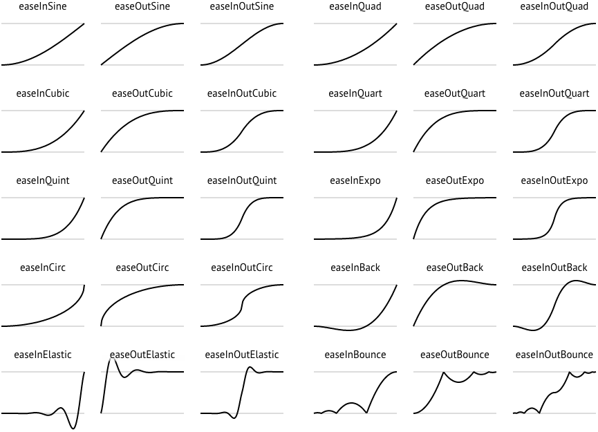

# CHEAT SHEET

## CORE

### Surface

    Create  // creation d'un context ( window )
    Update // Mise à jour du context
    Dispose // release context
    HasQuit // si on doit quitter
    WantToQuit // veut quitter
    Structs :
        Events // contiens tous les event de la surface
        Settings // modifier les parametres de création de la surface

## MATH

- convert degré to radian et vise versa ( change la valeur ,mutable)
    float degrees = 90.f
    float radians = degrees.ToRadians();
- convert degrée to radians et vise versa ( immutable, ne change pas la valeur)
    float degrees = ToDeg( 3.14f) ;

### Constantes

### Ease Functions



### Random

    ```c#
    using var random = new MiniPCG32( ); // Créer un instance d'un générateur de nombre aléatoire utilisant algo PCG32 
        _ = random.Next(0 , 100); // genere un nombre aléatoire entre min et max 
        _ = random.NextBool(); // génere un booleen aléatoire 
        _ = random.NextFloat(0.0f, 1.0f); // génere un float entre min et max 
        _ = random.Next(); // genere un nombre aléatoire
        _ = random.NextFloat(); // génere un float aléatoire
    //automatique Dispose if use keyword using otherwise call random.Dispose();
    ```

### Utils

    ```c#
    using static RitaEngine.Core.Utils;
    AddressOf<TypeOfObject>(TypeOfObject objet )//retourne l'adress mémoire phyique du paramètre cc 
    SizeOf<T>() // Retourn la taille de l'élément
    Strlen(sbyte* str) // retourne la longueur de la chaine pointé 
    StringToBytes( value) //convertie string value to tableau de byte[]
    FloatsToBytes(float[] data)//
    FloatToBytes(float data)//
    ByteToBytes(byte v)// 
    BoolToBytes(bool v)
    ShortToBytes(short v)
    UShortToBytes(ushort v)
    IntToBytes(int v)
    UIntToBytes(uint v)
    LongToBytes(long v)
    ULongToBytes(ulong v)
    BytesToUshort(  byte[] data )
    BytesToShort(  byte[] data )
    BytesToUInt(  byte[] data)
    BytesToInt(  byte[] data)
    BytesToULong(  byte[] data)
    BytesToLong(  byte[] data )

    RotateLeft(ulong value, int bits)
    RotateRight(ulong value, int bits)
    PartialBytesToUInt32(byte* ptr, int leftBytes)
     
    Swap64bits( ulong n)
    Swap32bits( uint n)
    Swap16bits( ushort n)

    GetHashCode(byte[] data)

    ```

### LibraryLoader

    ```c#
    using RitaEngine.Device.Implement; 
    LibraryLoader.Load(dllname );
    LibraryLoader.Unload(modulePtr);
    LibraryLoader.GetUnsafeSymbol( modulePtr, symbolName );

    //automatique Dispose if use keyword using otherwise call random.Dispose();
    ```

### Log

     ```c#
    using RitaEngine.Debug; 
    Log.Info(string message );
    Log.Warning(string message);
    Log.WarnWhenConditionIsFalse( bool condition, string message);
    Log.Critical(string message);
    Log.Error(string message);
    ```

### DebugGuard

     ```c#
    using RitaEngine.Debug; 
    Guard.IsNull()
    ```

## Context

### Surface

    Create  // creation d'un context ( window )
    Update // Mise à jour du context
    Dispose // release context
    HasQuit // si on doit quitter
    WantToQuit // veut quitter
    Structs :
        Events // contiens tous les event de la surface
        Settings // modifier les parametres de création de la surface

## MATH

- convert degré to radian et vise versa ( change la valeur ,mutable)
    float degrees = 90.f
    float radians = degrees.ToRadians();
- convert degrée to radians et vise versa ( immutable, ne change pas la valeur)
    float degrees = ToDeg( 3.14f) ;

### Constantes

### Ease Functions


### Random

    ```c#
    using var random = new MiniPCG32( ); // Créer un instance d'un générateur de nombre aléatoire utilisant algo PCG32 
        _ = random.Next(0 , 100); // genere un nombre aléatoire entre min et max 
        _ = random.NextBool(); // génere un booleen aléatoire 
        _ = random.NextFloat(0.0f, 1.0f); // génere un float entre min et max 
        _ = random.Next(); // genere un nombre aléatoire
        _ = random.NextFloat(); // génere un float aléatoire
    //automatique Dispose if use keyword using otherwise call random.Dispose();
    ```

utilisation site pour ascii :
https://patorjk.com/software/taag/#p=display&f=Electronic&t=SURFACE
